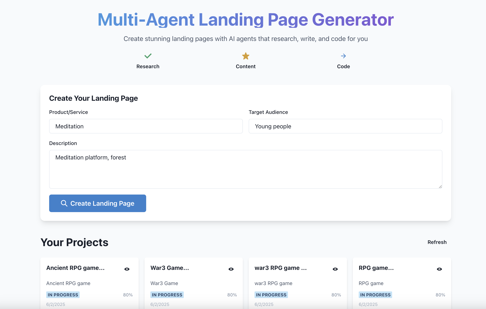
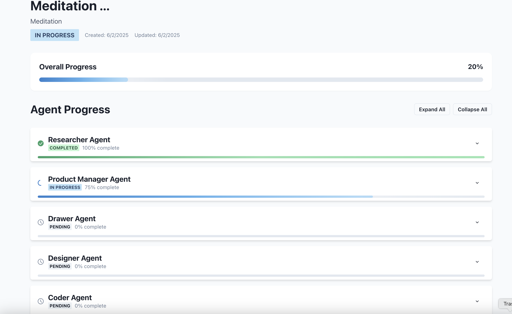
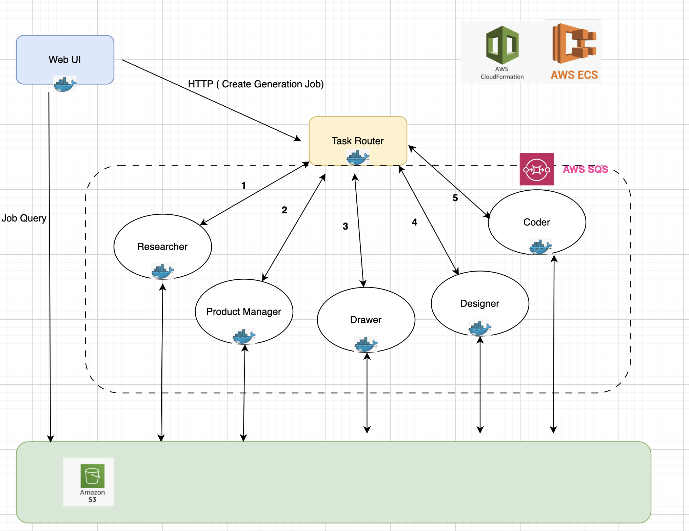
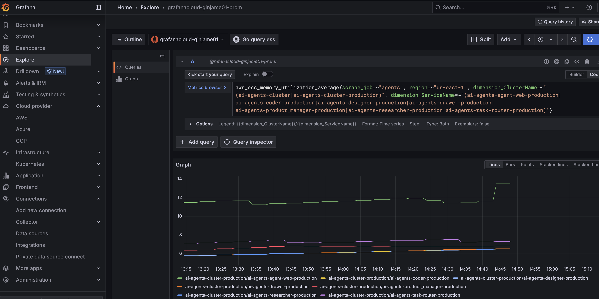
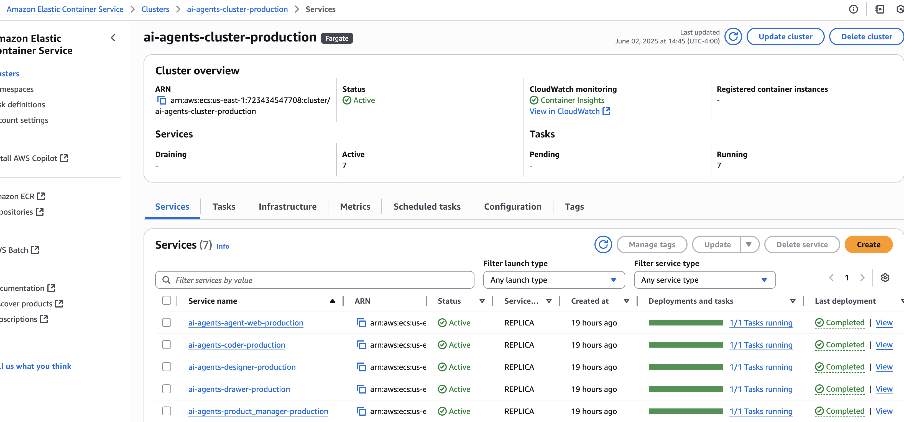
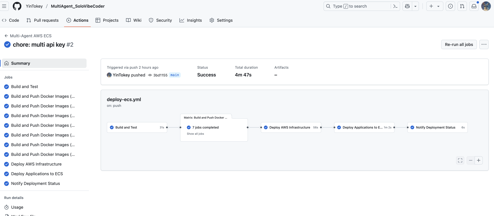

## A. Project Name
**Multi Agent**

## B. Elevator Pitch
Solo indie hackers want to ship fast but lack design sense.

This tool Using multi agent to generate decent landing page code in minutes.

So they can copy the generated React.js code into their project.

## C. Created By

Group Name: **Solo Vibe Coder**

Participant Name: **Yinjian Chen**

## D. Here’s the Whole Story
Last month I started my solo development journey; with my pure developer background, I struggled to design a beautiful UI. I spent a lot of time scrolling through X and found some designers posted landing page designs that got a lot of impressions. I thought maybe many solo indie hackers need a fast, cost‑friendly solution to build their project’s landing page. So I decided to build it

## E. It’s Built With
- Next.js, OpenAI API, LangGraph, Docker, Github Action 
- AWS (Cloudformation, ECS, S3, SQS)

## F. Image Gallery

## G. Project Link
http://ai-agents-alb-production-1974946315.us-east-1.elb.amazonaws.com/

## H. Video Demo
https://drive.google.com/file/d/131XaAsIXCi0P6c6Fqz-xuBLaKBA0YEP1/view?usp=share_link

